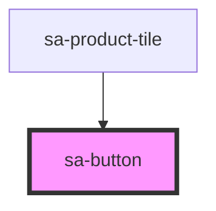

# sa-button

<!-- Auto Generated Below -->

## Properties

| Property   | Attribute  | Description | Type                       | Default     |
| ---------- | ---------- | ----------- | -------------------------- | ----------- |
| `disabled` | `disabled` |             | `boolean`                  | `undefined` |
| `type`     | `type`     |             | `string`                   | `undefined` |
| `variant`  | `variant`  |             | `"primary" \| "secondary"` | `undefined` |

## Dependencies

### Used by

 - [sa-product-tile](../product-tile)

### Graph

----------------------------------------------

*Built with [StencilJS](https://stenciljs.com/)*
