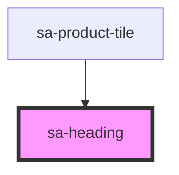

# sa-heading

<!-- Auto Generated Below -->

## Properties

| Property  | Attribute | Description | Type                                        | Default     |
| --------- | --------- | ----------- | ------------------------------------------- | ----------- |
| `as`      | `as`      |             | `"h1" \| "h2"`                              | `undefined` |
| `variant` | `variant` |             | `"large" \| "medium" \| "small" \| "title"` | `undefined` |

## Dependencies

### Used by

 - [sa-product-tile](../product-tile)

### Graph

----------------------------------------------

*Built with [StencilJS](https://stenciljs.com/)*
