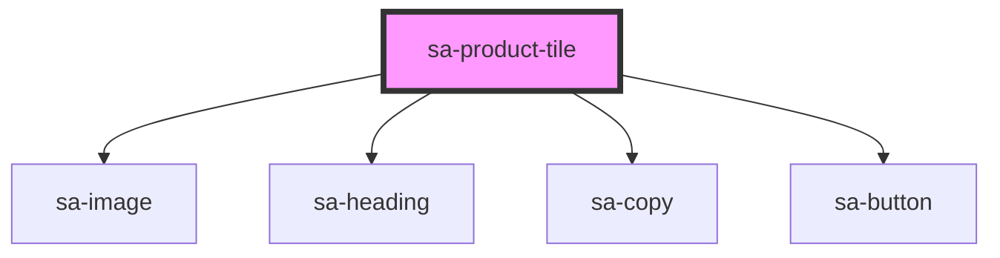

# sa-product-tile

<!-- Auto Generated Below -->

## Properties

| Property   | Attribute  | Description | Type     | Default     |
| ---------- | ---------- | ----------- | -------- | ----------- |
| `img`      | `img`      |             | `string` | `undefined` |
| `name`     | `name`     |             | `string` | `undefined` |
| `price`    | `price`    |             | `number` | `undefined` |
| `quantity` | `quantity` |             | `number` | `undefined` |

## Events

| Event         | Description | Type               |
| ------------- | ----------- | ------------------ |
| `addedToCart` |             | `CustomEvent<any>` |
| `removed`     |             | `CustomEvent<any>` |

## Dependencies

### Depends on

- [sa-image](../image)
- [sa-heading](../heading)
- [sa-copy](../copy)
- [sa-button](../button)

### Graph

----------------------------------------------

*Built with [StencilJS](https://stenciljs.com/)*
